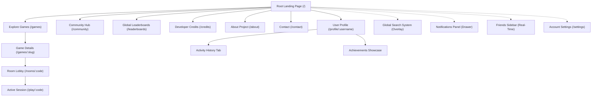
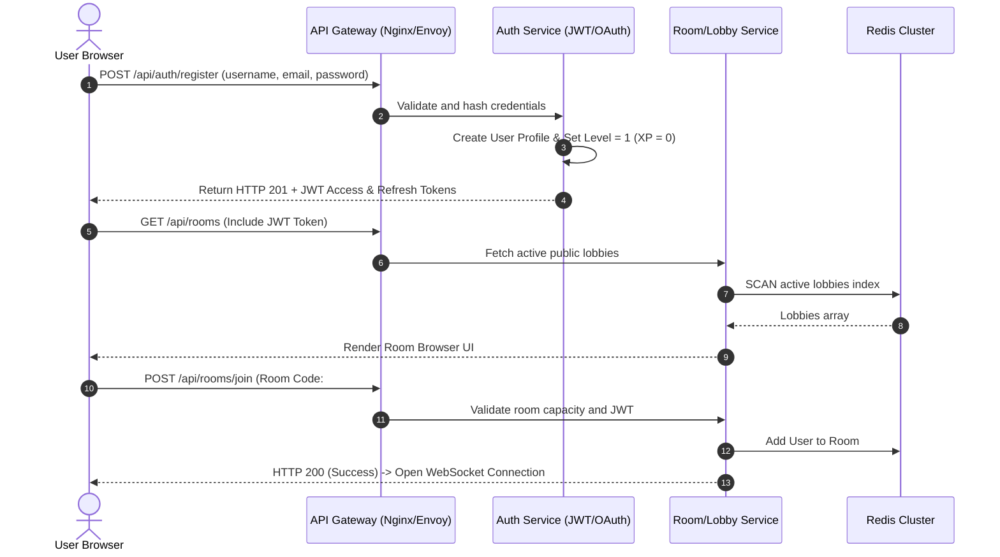
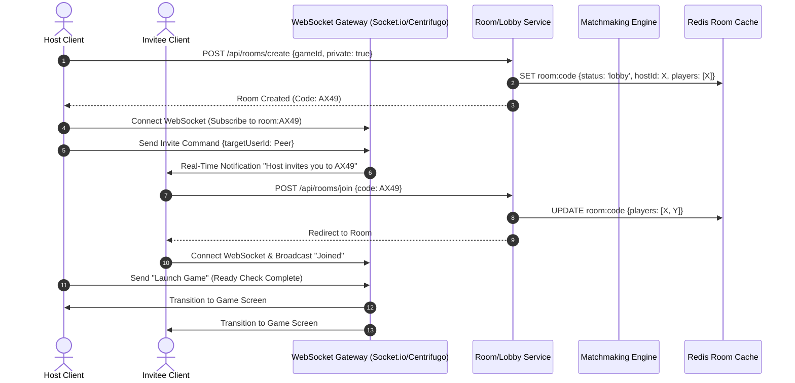
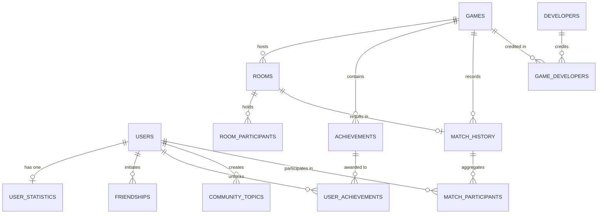

# UniGames Platform Architecture & Scalability Blueprint

This blueprint outlines the complete system architecture, UX hierarchy, database entity models, real-time synchronization strategy, and scalability roadmap for **UniGames**—a unified social gaming platform designed to scale to 100,000+ concurrent/active users.

---

## 1. Sitemap & Navigation Hierarchy

UniGames uses a hybrid single-page-application (SPA) layout with dynamic overlay panels (modals/drawers) for transient actions (like Search, Notifications, and Friends List) to maximize social immersion and ensure zero interruption to active gameplay.



### URL Routing & Access Control Matrix

| Route | Page | Access Level | Description |
| :--- | :--- | :--- | :--- |
| `/` | Landing Page | Public | Hero, stats, roadmap, and core platform value propositions. |
| `/games` | Explore Games | Public | Filtering, search, and status categorization of the 50+ catalog. |
| `/games/:slug` | Game Details | Public | Specifications, statistics, launch statuses, and Room creation/join CTAs. |
| `/rooms` | Room Browser | Authenticated | Live list of active public lobbies. |
| `/rooms/:code` | Room Lobby | Authenticated | Real-time pre-game lobby (chat, team selection, ready state). |
| `/play/:code` | Active Session | Authenticated | High-performance canvas/WebGL frame with active WebSocket connection. |
| `/profile/:username`| User Profile | Public | User metrics, badge showcase, activity feed, and XP level progress. |
| `/leaderboards` | Leaderboards | Public | Global & game-specific ranking lists, filterable by time. |
| `/community` | Community Hub | Authenticated | Forums, suggestions, feature requests, and community upvote module. |
| `/credits` | Developer Credits | Public | Contributor wall, role matrix, and open-source contribution map. |
| `/about` | About Project | Public | Project genesis, tech stack walkthrough, and platform vision. |
| `/contact` | Contact Page | Public | Support channels, business inquiries, and bug reporting hooks. |
| `/settings` | Account Settings | Authenticated | Privacy, profile customization, keybinds, and audio/graphics configs. |

---

## 2. Key User Journey Flows

### Journey A: Registration to Game Session (First-Time User)
This flow displays how a new visitor registers, updates their credentials, finds a lobby, and joins a game.



### Journey B: Real-Time Matchmaking & Room Creation
This flow details how a user hosts a session, invites friends, and launches a game.



---

## 3. Database Entity Planning

We adopt a **Polyglot Persistence Architecture**:
* **PostgreSQL (Relational)**: Selected for core profile structures, financial transaction ledgers, friendships, achievement definitions, and community content to guarantee transactional integrity and strict constraints.
* **Redis (In-Memory Key-Value)**: Handles active lobbies, matchmaking pools, active session states, and real-time leaderboards.

### Entity Relationship Diagram (PostgreSQL)



### Core Schema Definition & Indexing Strategy

```sql
-- Core User Profile Table
CREATE TABLE users (
    id UUID PRIMARY KEY DEFAULT gen_random_uuid(),
    username VARCHAR(30) UNIQUE NOT NULL,
    email VARCHAR(255) UNIQUE NOT NULL,
    password_hash VARCHAR(255) NOT NULL,
    avatar_url VARCHAR(512),
    bio VARCHAR(500),
    xp_points INT DEFAULT 0 NOT NULL,
    level INT DEFAULT 1 NOT NULL,
    join_date TIMESTAMP WITH TIME ZONE DEFAULT CURRENT_TIMESTAMP NOT NULL,
    updated_at TIMESTAMP WITH TIME ZONE DEFAULT CURRENT_TIMESTAMP NOT NULL
);
CREATE INDEX idx_users_xp ON users(xp_points DESC);
CREATE INDEX idx_users_username_trgm ON users USING gin(username gin_trgm_ops);

-- User Statistics Aggregate Table (Fast Lookup)
CREATE TABLE user_statistics (
    user_id UUID PRIMARY KEY REFERENCES users(id) ON DELETE CASCADE,
    games_played INT DEFAULT 0 NOT NULL,
    wins INT DEFAULT 0 NOT NULL,
    losses INT DEFAULT 0 NOT NULL,
    total_playtime_secs INT DEFAULT 0 NOT NULL,
    current_streak INT DEFAULT 0 NOT NULL
);

-- Friendships (Bi-directional Adjacency List)
CREATE TABLE friendships (
    user_id UUID REFERENCES users(id) ON DELETE CASCADE,
    friend_id UUID REFERENCES users(id) ON DELETE CASCADE,
    status VARCHAR(20) DEFAULT 'pending' NOT NULL, -- pending, accepted, blocked
    created_at TIMESTAMP WITH TIME ZONE DEFAULT CURRENT_TIMESTAMP NOT NULL,
    PRIMARY KEY (user_id, friend_id),
    CONSTRAINT chk_self_friend CHECK (user_id != friend_id)
);
CREATE INDEX idx_friendships_lookup ON friendships(friend_id) WHERE status = 'accepted';

-- Games Catalog Management
CREATE TABLE games (
    id UUID PRIMARY KEY DEFAULT gen_random_uuid(),
    slug VARCHAR(100) UNIQUE NOT NULL,
    name VARCHAR(100) NOT NULL,
    category VARCHAR(50) NOT NULL, -- Card, Board, Arcade, Strategy
    status VARCHAR(30) DEFAULT 'coming_soon' NOT NULL, -- active, maintenance, coming_soon, prototyping
    release_date VARCHAR(30), -- E.g. "Q4 2026", "July 12"
    multiplayer_type VARCHAR(50) NOT NULL, -- 2-Player, 4-Player, Co-op, MMO
    dev_progress_percent INT DEFAULT 0 CHECK (dev_progress_percent BETWEEN 0 AND 100),
    description TEXT,
    banner_url VARCHAR(512)
);
CREATE INDEX idx_games_status ON games(status);

-- Achievements Schema
CREATE TABLE achievements (
    id UUID PRIMARY KEY DEFAULT gen_random_uuid(),
    game_id UUID REFERENCES games(id) ON DELETE CASCADE,
    name VARCHAR(100) NOT NULL,
    description VARCHAR(255) NOT NULL,
    badge_icon_url VARCHAR(512),
    xp_reward INT DEFAULT 100 NOT NULL,
    difficulty VARCHAR(20) DEFAULT 'common' NOT NULL -- common, rare, epic, legendary
);

-- User-Achievement Junction Table
CREATE TABLE user_achievements (
    user_id UUID REFERENCES users(id) ON DELETE CASCADE,
    achievement_id UUID REFERENCES achievements(id) ON DELETE CASCADE,
    unlocked_at TIMESTAMP WITH TIME ZONE DEFAULT CURRENT_TIMESTAMP NOT NULL,
    PRIMARY KEY (user_id, achievement_id)
);

-- Community Discussion & Upvote Engine
CREATE TABLE community_topics (
    id UUID PRIMARY KEY DEFAULT gen_random_uuid(),
    title VARCHAR(150) NOT NULL,
    content TEXT NOT NULL,
    author_id UUID REFERENCES users(id) ON DELETE SET NULL,
    category VARCHAR(30) NOT NULL, -- discussion, suggestion, feedback, feature_request
    status VARCHAR(20) DEFAULT 'open' NOT NULL, -- open, closed, implemented, planned
    votes_count INT DEFAULT 0 NOT NULL,
    created_at TIMESTAMP WITH TIME ZONE DEFAULT CURRENT_TIMESTAMP NOT NULL
);
CREATE INDEX idx_community_topics_category_votes ON community_topics(category, votes_count DESC);

CREATE TABLE community_votes (
    user_id UUID REFERENCES users(id) ON DELETE CASCADE,
    topic_id UUID REFERENCES community_topics(id) ON DELETE CASCADE,
    vote_type VARCHAR(10) NOT NULL, -- upvote, downvote
    created_at TIMESTAMP WITH TIME ZONE DEFAULT CURRENT_TIMESTAMP NOT NULL,
    PRIMARY KEY (user_id, topic_id)
);
```

### Redis Key Schema (Transient & Live Data)
* **Lobby Data structure (Hash)**: `room:{roomCode} -> { "gameId": UUID, "status": "lobby", "players": "JSON_ARRAY_OF_IDS" }`
* **Real-time Leaderboards (Sorted Set)**: `leaderboard:{gameId} -> member: {userId}, score: {rankingValue}`
* **Active Player Registry (Set)**: `platform:online_players -> {userId1, userId2}`

---

## 4. Room System Architecture

To guarantee low latency (<50ms state synchronization), the Room System uses a WebSocket-based event broker orchestrated by a Room Coordinator.

```
       [ Client Client Client ]
                  │ (WebSocket Connection)
                  ▼
         [ WebSockets Cluster ] ── (Real-time updates)
                  │
        ┌─────────┴─────────┐
        ▼                   ▼
[ Room Controller ]   [ Redis Pub/Sub ]
        │                   │ (Broadcast status)
        └─────────┬─────────┘
                  ▼
         [ Redis State Store ]
```

### Protocol Mechanics
1. **Initiation**: The host requests room creation through `POST /api/rooms/create`. The database validates game parameters, and Redis registers a room hash containing:
   * Unique Room Code: 6-character alphanumeric (e.g. `X7Y8Z9`), generated with collision retry fallback.
   * Player Slots: List of user profiles and matching WebSocket handles.
2. **Synchronization**: Once connected, all users subscribe to the Redis Pub/Sub channel mapping to their room code. State updates (ready checks, settings shifts, spectator join) bypass Postgres and are broadcasted to all connected clients in real-time.
3. **Spectator Mode**: Spectators join the room with read-only state subscriptions. They do not publish game input coordinates, only receive outgoing game events from the WebSocket connection, reducing network load on active players.
4. **Resiliency**: If a client suffers a connection drop, the Room Coordinator retains their active slot for 60 seconds (grace period) allowing them to reconnect without relinquishing their spot.

---

## 5. Web UX Architecture & Feature Breakdown

To ensure a high-end, premium experience, the platform incorporates responsive layouts, HSL-tailored color palettes, sleek dark modes, subtle hover effects, and micro-animations to create a responsive interface.

### Detailed UI/UX Layout Specifications

#### 1. Landing Page
* **Hero Section**: High-impact vector animation showing dynamic multiplayer assets. Glassmorphism overlay showing active global numbers. Fast CTA: "Launch Quick Lobby" and "Explore Catalog".
* **Platform Benefits**: Features modular grids showcasing zero-download instant play, cross-device matchmaking, persistent statistics, and low-latency servers.
* **Featured Games & Upcoming Games Carousel**: Carousels showcasing detailed cards. High-fidelity layouts display active player counts on active titles, and release dates/milestones on upcoming ones.
* **Community Stats & Active Players Map**: Live counters mapping current matches, daily active users, and total XP distributed.
* **Developer Showcase**: Grid displaying core contributors with dynamic hover-triggered skill chips.
* **Roadmap**: Visual timelines tracking milestones from Alpha prototype to 50+ Games launch.

#### 2. Games Catalog & Detail System
* **Explore Page (`/games`)**: Multimodal search/filter workspace. Toggle options group titles into: *Active*, *In Prototyping*, *Alpha Testing*, and *Coming Soon*.
* **Status Badge Design Rules**:
  * `Live / Playable`: Glowing emerald dot, current match count, instant play button.
  * `Alpha Testing`: Warning gold badge, user feedback link, application form to join testers group.
  * `In Prototyping`: Deep purple icon indicating active coding. Includes progress meter (e.g. 65%).
  * `Coming Soon`: Minimalist charcoal frame with a community upvote widget: *"Vote to Accelerate Development"*.
* **Game Details Page**: Game rules, controls, system configurations, high scores list, and direct access controls to create custom rooms.

#### 3. Social Space (Profiles, Friends, & Messaging)
* **User Profile**: Card design featuring:
  * User Details: Username, Custom Bio, Join Date, XP progress ring.
  * Custom Badges: Interactive icons denoting platform milestones (e.g. "Vanguard Tester", "50 Wins Club").
  * Activity Timeline: Dynamic feeds detailing unlocked achievements, matches played, and community upvotes.
* **Friends System**: A collapsible slide-out drawer accessible from any platform view. Tracks online status, current game state (e.g. "Playing Ludo in Room #AX49"), and offers a one-click invite button.

#### 4. Community Feedback Hub
* **Forum System**: Dedicated portal where users can create posts matching categories: *Bug Report*, *Feature Request*, *General Discussion*.
* **Upvote Queue**: Users vote to prioritize feature requests. High-ranked feature requests are tagged for integration into the public platform roadmap.

#### 5. Developer Hub & Infrastructure credits
* **Contributor Pages**: Dedicated space hosting profile pages for contributors, showcasing specific modules authored, GitHub contributions, roles (e.g., UI Designer, Game Dev), and social handles.

---

## 6. Scalability & Resilience Strategy (100k+ Users)

```
                       [ Cloudflare Edge CDN & DNS ]
                                     │
                                     ▼
                      [ Nginx / Envoy Load Balancers ]
                                     │
                  ┌──────────────────┼──────────────────┐
                  ▼                  ▼                  ▼
          [ Auth Service ]    [ Game Service ]   [ Room Service ]
          (Node.js / Go)      (Node.js / Go)     (Go / WebSockets)
                  │                  │                  │
         ┌────────┴────────┐         │         ┌────────┴────────┐
         ▼                 ▼         ▼         ▼                 ▼
  [ Postgres Read ] [ Postgres Write ] ◄───────[ Redis Cache & PubSub ]
```

### 1. Data Layer Scalability
* **Read-Write Replication**: Primary database cluster manages writes, while secondary read replicas handle read-heavy traffic (like user profiles, statistics, and leaderboard scans).
* **Database Partitioning**: The `match_history` and `match_participants` tables will be partitioned by year/month to ensure indexes fit comfortably within memory limits.
* **Redis Cache Sharding**: Active lobby states are sharded using key hashes, allowing memory loads to distribute evenly across multiple nodes.

### 2. Networking & Traffic Distribution
* **WebSocket Clustering**: WebSocket nodes run behind load balancers with sticky sessions enabled (IP hash / Cookie based routing) to guarantee TCP connectivity remains anchored to the correct node.
* **Global Edge CDN**: Static assets (game engines, images, and user avatars) are cached close to users via Cloudflare, reducing overall server bandwidth overhead.

### 3. Server Optimization
* **Stateless Application Servers**: All API services are packaged into Docker containers running on Kubernetes, allowing automatic horizontal pod scaling when average CPU utilization crosses 70%.

---

## 7. Phased Implementation Roadmap

### MVP (Minimum Viable Product)
**Focus**: Core platform infrastructure, identity verification, community feedback loop, and foundational lobby mechanics.

* **Landing Page**: Fully implemented static landing page, featuring coming-soon game previews and team spotlights.
* **Authentication**: Email/password registration, secure JWT token issuance, and profile creation.
* **1-2 Casual Games**: Launch with 2 simple multiplayer games (e.g. Tic-Tac-Toe, Chess) to test real-time room mechanics.
* **Coming Soon Placeholders**: Fully interactive card grids for planned games, including the upvote module.
* **Basic Room System**: Room creation, room code lookups, and basic in-lobby player lists.
* **Community Features**: Upvote queue and feature suggestion form.

### Version 1.0 (Public Release)
**Focus**: Expanded game catalog, real-time social tools, and platform metrics.

* **Game Catalog**: Extend active library to 10 multiplayer games.
* **Friends List & Presence**: Online status tracking, real-time messaging, and in-app room invitations.
* **Developer Credits Section**: Profile pages for all contributors, linking directly to GitHub projects.
* **Complete Search System**: Full-site searches covering rooms, games, and user profiles.
* **Global Notifications**: In-app toast messages and custom email alerts for social notifications.

### Version 2.0 (Growth & Engagement)
**Focus**: Progression, persistence, and tournament infrastructure.

* **Progression Systems**: Detailed user levels, game-specific experience tracks, and unlocks.
* **Achievement Engine**: In-game achievements linked to profile badges.
* **Global & Local Leaderboards**: Real-time rank calculations using Redis sorted sets.
* **Advanced Spectator Mode**: Allow users to join active matches as viewers with minimized connection load.

### Future Expansion (Scalability & Customization)
**Focus**: Ecosystem growth and programmatic expansion.

* **50+ Games Catalog**: Gradual integration of new social, arcade, and card games.
* **Developer SDK**: Publish toolkits enabling external developers to build and submit games to the platform.
* **Native Apps**: Wrapper-based mobile applications (iOS & Android) with push notification support.
* **Custom Customizations Shop**: Introduce cosmetic profile adjustments (borders, tags) unlockable with game XP.

---

## 8. Development Verification Plan

### Stage 1: Automated Unit & Integration Testing
* **Identity Protocols**: Verify registration and validation endpoints (e.g. `/api/auth/register`, `/api/auth/login`).
* **Relational Database Schemas**: Test constraints, cascading deletions, and bi-directional indexing.
* **Room API Routing**: Validate that room code generation fails safely on collisions and manages player capacity checks.

### Stage 2: Load & Latency Testing
* **Mock Traffic Generation**: Run test scripts to simulate 5,000 parallel clients requesting room listings to test DB capacity.
* **WebSocket Stress Testing**: Use load-testing tools (e.g. Artillery) to run 10,000 WebSocket connections on a staging environment to monitor CPU and memory consumption.
